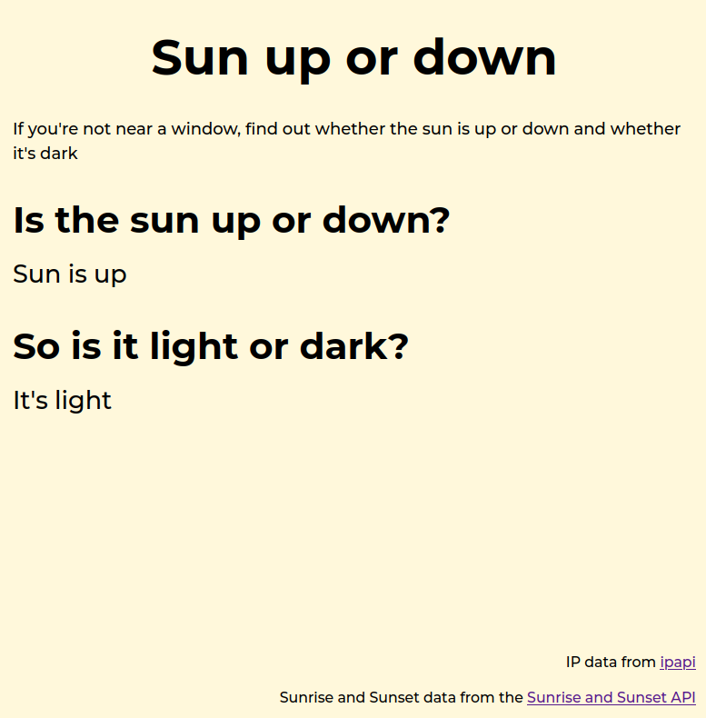

# Sun up or down

A silly app that looks up your IP address and tells you whether the sun is up or down and whether it's light or dark.

## Table of contents

- [General info](#general-info)
- [Screenshots](#screenshots)
- [Technologies](#technologies)
- [Setup](#setup)
- [Status](#status)

## General info

This uses the [Sunrise and Sunset API](https://sunrise-sunset.org/api) together with [ipapi](https://ipapi.co/) to find the IP's location

## Screenshots



## Technologies

- CSS
- JavaScript
- Vite

## Setup

To view this project visit the [demo](https://sun-up-or-down.pages.dev/) or download the files, open a terminal in that folder and install locally using npm:

```
npm install
```

Then run the app locally:

```
npm run dev
```

## Status

Project is: _finished_
